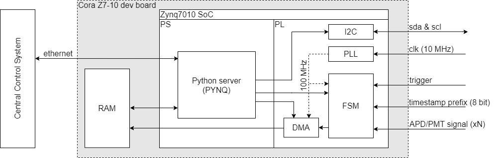

# lidarTDC
## System requirements
* Time-to-digital converter (TDC) with a temporal resolution better than 10 ns and an integration time of up to 2 ms.
* Trigger input
* 8 bit temporal timestamp prefix
* External ref clk (10MHz)

## System architecture

| Item          | Description |
| ------------- | ------------- |
| Cora-Z7-07  | Digilent low cost development board (see [here](https://store.digilentinc.com/cora-z7-zynq-7000-single-core-and-dual-core-options-for-arm-fpga-soc-development)) featuring a Xilinx Zynq 7007 SoC FPGA, 1Gbps Ethernet PHY, RAM memory, USB hub, 45 arduino compatible IOs (3.3V CMOS)...|
| Zynq7007  | System on a chip. Contains a 32bit-ARM processing sytem (PS) and programable logic (PL). |
|RAM|512MB DDR3 on-board memory. Accessible to both PS and PL (via DMA).|
|Python Server|Devoted to the configuration/operation of the PL. It is has direct access to the data storen in the RAM memory. Control commands and data connected are transfered via the 1Gbps etherent PHY.  |
| FSM  | Finite state machine implementing the TDC logic. Operating modes: direct / historgram (explained below).  |
| PLL  | Phase lock loop. |
| DMA  | Direct memory access. Streams data from RAM to FSM and vice-versa.  |
